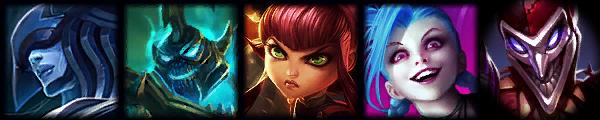

<h1 align="center">Moba AID 🎮</h1>

<div align="center"></div>

## General informations

MOBA AID uses Genetic Algorithm to suggest champions on the League of Legends Picks & Bans phase.

API documentation is available [here](https://moba-aid.herokuapp.com/api/docs).

## Contributors

| [<br><sub>@eliocosta</sub>](https://github.com/eliocosta) | [<br><sub>@santospatrick</sub>](https://github.com/santospatrick) |
| :---: | :---: |

## Authors

| [<br><sub>@tekpixo</sub>](https://github.com/tekpixo) | [<br><sub>@fcarlosmonteiro</sub>](https://github.com/fcarlosmonteiro) 
| :---: | :---: |

## Published articles

Full read available [here](https://www.researchgate.net/publication/337260793_An_Approach_for_Team_Composition_in_League_of_Legends_using_Genetic_Algorithm).


```
@INPROCEEDINGS{Costa2019, 
author={L. M. {Costa} and A. C. C. {Souza} and F. C. M. {Souza}}, 
booktitle={2019 18th Brazilian Symposium on Computer Games and Digital Entertainment (SBGames)}, 
title={An Approach for Team Composition in League of Legends using Genetic Algorithm}, 
year={2019}, 
pages={52-61}
}
```

# Disclaimer

`MOBA AID` is **not** endorsed by Riot Games and does **not** reflect the views or opinions of Riot Games or anyone officially involved in producing or managing League of Legends. League of Legends and Riot Games are trademarks or registered trademarks of Riot Games, Inc. League of Legends © Riot Games, Inc.
